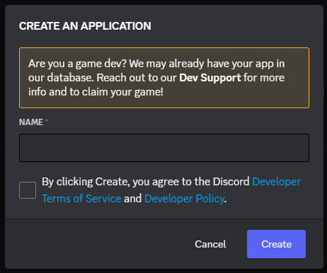
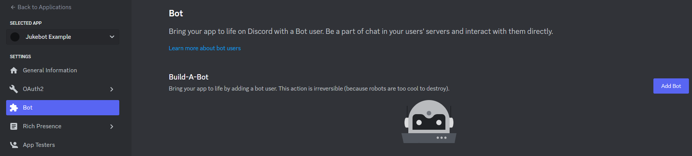
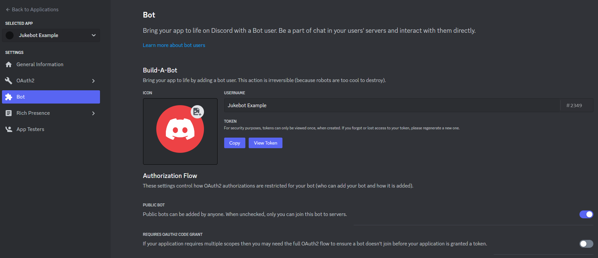
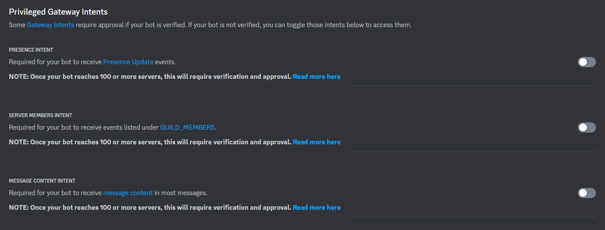
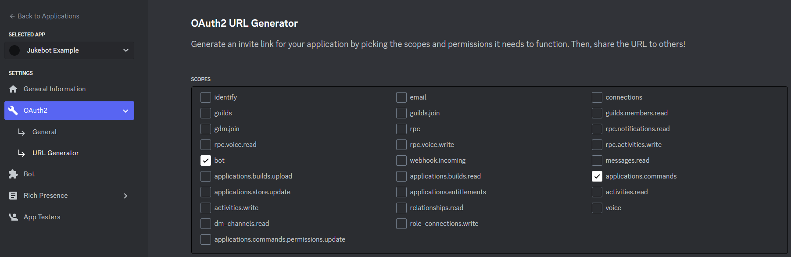

# Installation Guide <!-- omit in toc -->

- [0. Install Main Dependencies](#0-install-main-dependencies)
- [1. Make a Discord Developer Application](#1-make-a-discord-developer-application)
- [2. Setup Repository \& Dependencies](#2-setup-repository--dependencies)
- [3. Configure the Bot](#3-configure-the-bot)
- [4. Setup Spotify Auth (Optional)](#4-setup-spotify-auth-optional)
- [5. Setup YouTube Auth (Optional)](#5-setup-youtube-auth-optional)
- [6. Run the Bot](#6-run-the-bot)


## 0. Install Main Dependencies

You will need to manually install the following things on your system and add them to your path:

-   [Node JS](https://nodejs.org/) v16 or higher. Non-LTS and versions below 16 will probably work, but haven't been tested.
    - Test this by running `node -v` in a terminal.
-   [pnpm](https://pnpm.io/), recommended but npm and yarn should still work fine.
    -   If you've properly installed Node JS, you should be able to install pnpm by simply running `npm i -g pnpm` in a terminal.

## 1. Make a Discord Developer Application

Head over to the [Discord developer applications](https://discord.com/developers/applications) page and create a new application.






Make sure you copy the bot's token, you'll need it for a later step.

Now you can head to the OAuth2 > URL Generator page and create an invite link for your bot, use this to add it to any server(s) of your choice.

-   Scopes: `bot`, `applications.commands`
-   Permissions: `Send Messages`, `Embed Links`, `Connect`, `Speak`




## 2. Setup Repository & Dependencies

Now you can set up the repository from a terminal:

```sh
git clone https://github.com/NachoToast/Jukebot.git Jukebot
cd Jukebot
pnpm install
cp config.example.json config.json
```

## 3. Configure the Bot

Enter your Discord bot token from step 1 into the [config.json](./config.json) file you created in step 2.

There are a lot of other configuration options you can give to the bot, and a JSON schema for all the values can be found [here](.github/config-schema.json).

## 4. Setup Spotify Auth (Optional)

If you want the bot to be able to queue songs from Spotify, you should do this step.

> If you get stuck in the following steps, you can consult [these instructions](https://github.com/play-dl/play-dl/tree/main/instructions#spotify)

1. Run the authorization script using `pnpm run auth` or `npm run auth`
2. Type "Yes" when prompted to save to file
3. Type "sp" for Spotify
4. Make a Spotify application from [here](https://developer.spotify.com/dashboard/applications), be sure to make a redirect URI for it in the `overview > edit settings` menu (this can be any valid URL).
5. Fill in your Spotify client ID, secret, and redirect URI when prompted
6. Enter "NZ" or your preferred country code
7. Follow the remaining instructions

## 5. Setup YouTube Auth (Optional)

If you want the bot to be able to queue age-restricted videos, you should do this step.

1. Run the authorization script using `pnpm run auth` or `npm run auth`
2. Type "Yes" when prompted to save to file
3. Type "yo" for YouTube
4. Follow [these instructions](https://github.com/play-dl/play-dl/tree/5d4485a54e01665ef2126d043f30498d8596c27a/instructions#youtube-cookies) to get cookies

## 6. Run the Bot

Now you can run the bot (and other scripts) using `pnpm start` (or `npm start`).